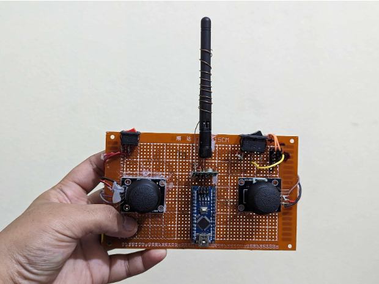
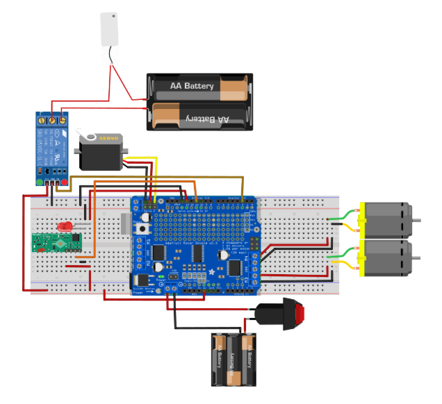
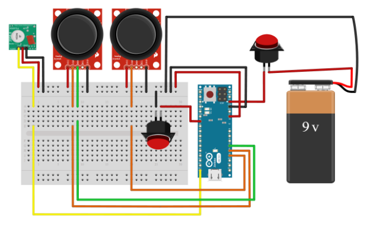

# Wireless Remote-Controlled Spray Boat (Microcontroller Project)

This repository contains an Arduino-based remote-controlled boat project with a spray mechanism. The project appears to be a small-scale prototype similar to an autonomous/wireless cleaning boat (like a "waste-shark" in miniature) that is controlled by an RF remote and uses DC motors for propulsion and a servo for the spray mechanism.

Repository link: https://github.com/al-mohaimin-farabi/microcontroller-project

Contents in this workspace:

- `transmeter/` — transmitter code for the RF remote controller (`transmeter.ino`).
- `recevier/` — receiver code for the boat (`receiver.ino`).
- `Arduino_Project.pdf` — project document (if present).
- Diagrams / images: `reciver_Diagram.png`, `TransMeter.png`, `Transmeter_Diagram.png`

## Summary (inferred from code)

- Communication: Uses RH_ASK library (ASK/OOK 433/315MHz RF modules) for simple wireless data packets.
- Transmitter: Reads two joysticks and a spray toggle switch. Sends a small packet of 4 bytes:
  - spray servo position (0-180)
  - spray switch state (0/1)
  - boat joystick X (scaled to 0-255)
  - boat joystick Y (scaled to 0-255)
- Receiver (boat): Receives the 4-byte packet, controls two DC motors via Adafruit Motor Shield (AFMotor), a servo for spray angle (ServoTimer2), and a digital pin to activate the spray pump/solenoid.

## Hardware (inferred)

- Arduino UNO or Nano (see upstream repo folders `uno/` and `nano/`)
- 433MHz RF ASK transmitter and receiver modules
- Adafruit Motor Shield (or compatible) and two DC motors
- Servo motor for spray angle (connected to the receiver's pin 10 in code)
- Joysticks (analog inputs on the transmitter: A0/A1/A2)
- Toggle switch for spray (digital input with pull-up on transmitter pin 2)
- Spray pump or actuator driven by a digital pin (receiver pin 2)

## Wiring / Pins (from code)

- Transmitter (`transmeter/transmeter.ino`):

  - S_VRX_PIN -> A0 (spray joystick X)
  - B_VRX_PIN -> A1 (boat joystick X)
  - B_VRY_PIN -> A2 (boat joystick Y)
  - SPRAY_SWITCH_PIN -> digital 2 (INPUT_PULLUP)

- Receiver (`recevier/receiver.ino`):
  - Servo attached to pin 10 (using ServoTimer2 library)
  - Spray control digital pin 2 (output)
  - Motor shield channels used: AF_DCMotor motorLeft(3), motorRight(4)

## Code notes

- The transmitter reads joystick values (0–1023), maps spray joystick to 0–180 for the servo, and scales the joystick X/Y values down by dividing by 4 when sending (to fit into 1 byte).
- The receiver maps received sprayPosition to servo PWM range via `spray_Angle.write(map(sprayPosition, 0, 180, 750, 2250));` and controls motors based on thresholds on the joystick values.
- Motor control uses a simple accelerate loop to ramp up speed to `MAX_SPEED` (250). Direction decisions are based on thresholds (forward/back/left/right) from joystick values.

## Usage

1. Upload `transmeter/transmeter.ino` to the transmitter Arduino. Connect joysticks and spray switch as in the wiring notes.
2. Upload `recevier/receiver.ino` to the boat Arduino. Connect motor shield, motors, servo, and spray actuator.
3. Power both sides appropriately and operate the transmitter. The code sends a 4-byte packet each loop; the receiver applies motor and spray commands when packets are received.

## Diagrams

Below are the main diagrams for this project. These illustrate the receiver wiring and the transmitter layout.

- **Receiver diagram**

  

- **Transmitter diagram**

  

## License & Attribution

This README was generated/updated locally using the files present in this workspace and the GitHub repository link provided by the user. Please check the upstream repository for original licensing information.

## Notes / Next steps

- I couldn't open `Arduino_Project.pdf` programmatically from this environment; if you want a README section based on the PDF's text, please either upload the PDF into the workspace root with the exact filename `Arduino_Project.pdf` or paste the PDF text here and I will incorporate its content into the README.
- If you'd like more detailed diagrams, I can extract pinouts and create a simple schematic image or add a table of signals.

## Documentation

Additional project documentation is available here:

https://docs.google.com/document/d/1et-pY81oIMAOb39NNZ7sHbCaDjX9CXgyzsgHG9zoDsQ/edit?tab=t.0
